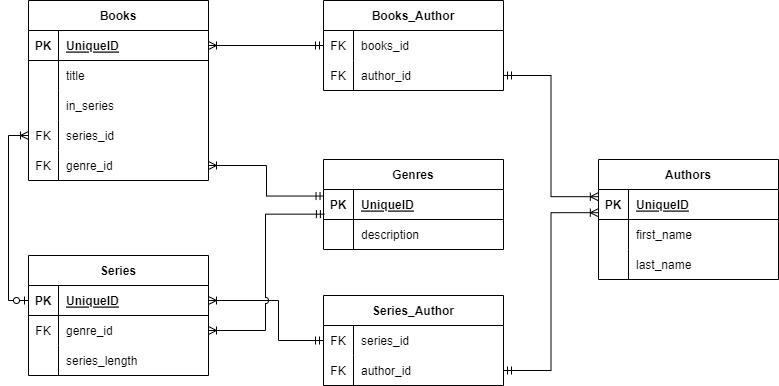

# CS340Project
This is a repository for a Introduction to Databases Course. 

#  Overview

A friend is an avid reader. Her personal library currently contains approximately 1,000 books. But she is constantly trading, selling and adding to her library. At the moment her library is increasing at about 30 books a month. That will amount to a 33% increase by the end of the year, with an estimation of similar percentage growth for the next 10 years. To help her manage her collection better, we will create a database driven website that will record Books to Authors, Series and Genres.

#  Database Outline

###  Books

Holds information about the different books in the database.

**book_id:** int, increment, unique, not Null, PK

**title:** varchar(255), not Null

**in_series:** bool, not Null

**series_id:** int, FK, Null

**genre_id:** int, not Null, FK

**Relationship:** a 1:M relationship between Series and Books is implemented with series_id as FK inside of Books. 

**Relationship:** a M:N relationship between Authors and Books is implemented through the Books_Authors intersection table.

**Relationship:** a 1:M relationship between Genres and Books is implemented with genre_id as FK inside of Books. 

### Authors

Holds information about the different authors that have books in the database.

**author_id:** int, increment, unique, not Null, PK

**first_name:** varchar(45), not Null

**last_name:** varchar(45), not Null

**Relationship:** a M:N relationship between Authors and Books is implemented through the Books_Authors intersection table.

**Relationship:** a M:N relationship between Authors and Series is implemented through the Series_Authors intersection table.

### Series

Holds information about the different series of books that are in the database.

**series_id:** int, increment, unique, not Null, PK

**series_length:** int, not Null

**genre_id:** int, not Null, FK

**Relationship:** a 1:M relationship between Series and Books is implemented with series_id as FK inside of Books. 

**Relationship:** a 1:M relationship between Genres and Series is implemented with genre_id as FK inside of Series. 

**Relationship:** a M:N relationship between Authors and Series is implemented through the Series_Authors intersection table.

### Genres
Holds information about the different genres of books that are contained in the database.

**genre_id:** int, increment, unique, not Null, PK

**name:** varchar(255), unique, not Null

**description:** varchar(255), not Null

**Relationship:** a 1:M relationship between Genres and Books is implemented with genre_id as FK inside of Books. 

**Relationship:** a 1:M relationship between Genres and Series is implemented with genre_id as FK inside of Series. 

### Books_Authors
Intersection table to facilitate M:N relationship between Books and Authors

**book_author_id:** int, increment, unique, not Null, PK

**book_id:** int, not Null, FK

**author_id:** int, not Null, FK

**Relationship:** a 1:M relationship between Books_Authors and Books is implemented with book_id as FK inside of Books_Authors. 

**Relationship:** a 1:M relationship between Books_Authors and Authors is implemented with author_id as FK inside of Books_Authors. 

### Series_Authors
Intersection table to facilitate M:N relationship between Series and Authors

**series_author_id:** int, increment, unique, not Null, PK

**series_id:** int, not Null, FK

**author_id:** int, not Null, FK

**Relationship:** a 1:M relationship between Series_Authors and Series is implemented with series_id as FK inside of Series_Authors. 

**Relationship:** a 1:M relationship between Series_Authors and Authors is implemented with author_id as FK inside of Series_Authors. 

# Entity-Relationship Diagram

